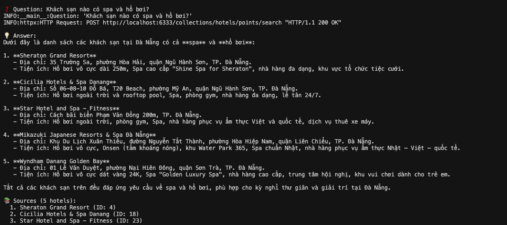

# 🏨 Hotel Recommendation System - Hệ Thống Gợi Ý Khách Sạn

## 📋 Mục Tiêu Dự Án

Hệ thống gợi ý khách sạn thông minh tại Đà Nẵng sử dụng các kỹ thuật **Machine Learning** và **RAG (Retrieval-Augmented Generation)** để:

1. **Gợi ý khách sạn cá nhân hóa** dựa trên lịch sử đặt phòng, đánh giá và sở thích của người dùng
2. **Tư vấn khách sạn thông minh** qua chatbot hỗ trợ tiếng Việt, có thể trả lời câu hỏi tự nhiên về khách sạn
3. **Tìm kiếm ngữ nghĩa** hiểu được ý định người dùng (ví dụ: "khách sạn 5 sao gần biển", "khách sạn giá rẻ ở Sơn Trà")
4. **Kết hợp nhiều phương pháp** để tối ưu hóa độ chính xác và trải nghiệm người dùng

---

## 🎯 Phương Pháp Thực Hiện

### 1. **Recommendation System (Hệ Thống Gợi Ý)**

Hệ thống sử dụng **5 phương pháp gợi ý** khác nhau:

#### **1.1 Collaborative Filtering (Lọc Cộng Tác)**
- **File**: `recommendation/collabritive_filtering.py`
- **Phương pháp**: Neural Collaborative Filtering (NCF) với TensorFlow/Keras
- **Ý tưởng**: Dựa trên hành vi tương tác của người dùng (user-hotel interactions)
- **Model**: Deep Learning model với user embeddings và item embeddings
- **Input**: User ID, Hotel ID, Rating/Booking history
- **Output**: Điểm dự đoán cho mỗi cặp (user, hotel)

#### **1.2 Popularity-Based (Dựa Trên Độ Phổ Biến)**
- **File**: `recommendation/popularity_based.py`
- **Phương pháp**: Weighted Rating (IMDb Formula)
- **Ý tưởng**: Gợi ý khách sạn phổ biến dựa trên đánh giá và số lượng đặt phòng
- **Công thức**: `WR = (v/(v+m)) × R + (m/(v+m)) × C`
  - `v`: Số lượng đánh giá
  - `m`: Ngưỡng tối thiểu
  - `R`: Điểm trung bình
  - `C`: Điểm trung bình toàn hệ thống

#### **1.3 Demographic-Based (Dựa Trên Nhân Khẩu Học)**
- **File**: `recommendation/demographic.py`
- **Phương pháp**: Phân nhóm người dùng theo đặc điểm (tuổi, giới tính, khu vực)
- **Ý tưởng**: Gợi ý khách sạn phù hợp với nhóm người dùng có đặc điểm tương tự

#### **1.4 Semantic Recommendation (Gợi Ý Ngữ Nghĩa)**
- **File**: `recommendation/semantic_recommendation_system.py`
- **Phương pháp**: Embedding-based search với vector database
- **Ý tưởng**: Tìm kiếm khách sạn dựa trên ngữ nghĩa của mô tả và yêu cầu
- **Technology**: 
  - Embedding model: BGE-M3 (via Ollama) hoặc Sentence Transformers
  - Vector DB: Qdrant
  - Hỗ trợ cả local embedding và Ollama API

#### **1.5 Improved Recommendation System (Hệ Thống Gợi Ý Cải Tiến)**
- **File**: `recommendation/improved_recommendation_system.py`
- **Phương pháp**: Kết hợp model NCF đã được train và tối ưu
- **Ý tưởng**: Sử dụng model đã được fine-tune trên dataset thực tế
- **Model**: TensorFlow SavedModel với user/item embeddings

### 2. **RAG System (Retrieval-Augmented Generation)**

Hệ thống chatbot thông minh sử dụng RAG để trả lời câu hỏi về khách sạn:

#### **2.1 Simple RAG System**
- **File**: `rag/simple_rag_system.py`
- **Phương pháp**: LangChain + Ollama + Qdrant
- **Technology Stack**:
  - **Embedding**: BGE-M3 (via Ollama) - hỗ trợ tiếng Việt tốt
  - **LLM**: Qwen3 (via Ollama) - hỗ trợ tiếng Việt rất tốt
  - **Vector DB**: Qdrant
  - **Framework**: LangChain

#### **2.2 Quy Trình Hoạt Động**:
```
1. Index Phase (Chỉ cần chạy 1 lần):
   - Load normalized hotel data
   - Embed mỗi hotel thành vector
   - Lưu vào Qdrant vector database

2. Query Phase:
   - User hỏi câu hỏi (VD: "Khách sạn nào 5 sao gần biển?")
   - Embed câu hỏi thành vector
   - Semantic search trong Qdrant (top-k results)
   - Retrieve relevant hotels
   - LLM generate answer dựa trên context
   - Return answer bằng tiếng Việt
```

#### **2.3 Ví Dụ Minh Họa**

Hệ thống RAG có thể trả lời các câu hỏi tự nhiên bằng tiếng Việt. Dưới đây là ví dụ kết quả khi hỏi: **"Khách sạn nào có spa và hồ bơi?"**



**Kết quả:**
- ✅ Hệ thống hiểu được câu hỏi tự nhiên bằng tiếng Việt
- ✅ Tìm kiếm và trả về 5 khách sạn phù hợp với yêu cầu
- ✅ Câu trả lời chi tiết, tự nhiên, hoàn toàn bằng tiếng Việt
- ✅ Bao gồm thông tin: tên khách sạn, địa chỉ, tiện ích (spa, hồ bơi, gym, nhà hàng...)
- ✅ Có citation cho từng khách sạn được sử dụng làm nguồn

#### **2.4 Data Normalization**
- **File**: `rag/hotel_data_normalization.py`
- **Mục đích**: Chuẩn hóa và làm giàu dữ liệu hotel để tạo semantic text
- **Output**: 
  - `normalized_hotels.csv`: Dữ liệu đã chuẩn hóa
  - `semantic_text`: Text mô tả đầy đủ cho mỗi hotel (dùng cho embedding)

---

## 📁 Cấu Trúc Code

### **Root Directory Structure**

```
RecommendationSystem/
├── datasets_extracted/          # Dữ liệu gốc (CSV files)
│   ├── tbl_hotel.csv
│   ├── tbl_customers.csv
│   ├── tbl_order.csv
│   ├── tbl_evaluate.csv
│   └── ...
│
├── processed/                   # Dữ liệu đã xử lý
│   ├── hotel2idx.json          # Mapping hotel ID → index
│   ├── user2idx.json           # Mapping user ID → index
│   └── models/
│       └── clean_ncf/           # Trained NCF model
│           ├── saved_model/    # TensorFlow SavedModel
│           ├── user_embeddings.npy
│           ├── item_embeddings.npy
│           ├── hotel2idx.json
│           └── user2idx.json
│
├── recommendation/             # Recommendation System
│   ├── collabritive_filtering.py    # Neural Collaborative Filtering
│   ├── popularity_based.py           # Popularity-based recommendation
│   ├── demographic.py               # Demographic-based recommendation
│   ├── semantic_recommendation_system.py  # Semantic search
│   ├── improved_recommendation_system.py # Improved NCF model
│   ├── user_hotel_interaction.py     # Data preprocessing
│   ├── api_service.py               # Flask API service
│   ├── extract_tables_to_csv.py      # Data extraction
│   ├── extract_tables_to_csv_v2.py   # Data extraction v2
│   ├── requirements.txt              # Dependencies
│   ├── requirements_api.txt          # API dependencies
│   ├── requirements_semantic.txt     # Semantic dependencies
│   └── docker-compose.yml            # Docker setup
│
├── rag/                        # RAG System
│   ├── simple_rag_system.py          # Main RAG system
│   ├── hotel_data_normalization.py    # Data normalization
│   ├── test_rag.py                    # Test script
│   ├── check_ollama.py                # Ollama checker
│   ├── normalized_data/               # Normalized data
│   │   ├── normalized_hotels.csv
│   │   ├── hotel_similarity_map.json
│   │   └── semantic_clusters.json
│   ├── requirements_rag.txt           # Dependencies
│   ├── docker-compose.yml             # Docker setup
│   ├── README_RAG.md                  # RAG documentation
│   ├── README_RUN_PROJECT.md          # Run guide
│   ├── README_RUN_NORMALIZATION.md    # Normalization guide
│   ├── VIETNAMESE_SUPPORT.md          # Vietnamese support guide
│   └── METHOD_LANGCHAIN_RAG.md        # LangChain method guide
│
└── README.md                   # This file
```

### **Chi Tiết Các Module**

#### **1. Recommendation Module** (`recommendation/`)

| File | Chức Năng | Input | Output |
|------|-----------|-------|--------|
| `collabritive_filtering.py` | Neural CF model training | User-hotel interactions | Trained NCF model |
| `popularity_based.py` | Popularity ranking | Ratings, bookings | Top-N popular hotels |
| `demographic.py` | Demographic filtering | User profiles | Group-based recommendations |
| `semantic_recommendation_system.py` | Semantic search | Query text | Similar hotels (vectors) |
| `improved_recommendation_system.py` | Load trained model | User ID | Top-N hotel recommendations |
| `api_service.py` | Flask REST API | HTTP requests | JSON responses |
| `user_hotel_interaction.py` | Preprocess interactions | Raw data | Clean interaction data |

#### **2. RAG Module** (`rag/`)

| File | Chức Năng | Input | Output |
|------|-----------|-------|--------|
| `simple_rag_system.py` | Main RAG system | Questions, hotel data | Vietnamese answers |
| `hotel_data_normalization.py` | Data preprocessing | Raw hotel CSV | Normalized + semantic text |
| `test_rag.py` | Test RAG system | - | Test results |
| `check_ollama.py` | Check Ollama setup | - | Ollama status |

#### **3. Data Processing**

| Directory | Chức Năng | Contents |
|-----------|-----------|----------|
| `datasets_extracted/` | Raw data | CSV files from database |
| `processed/` | Processed data | Mappings, embeddings, models |
| `rag/normalized_data/` | Normalized data | Semantic text, clusters |

### **Data Flow**

```
┌─────────────────────────────────────────────────────────────┐
│                    RAW DATA (CSV)                          │
│              datasets_extracted/*.csv                       │
└──────────────────────┬────────────────────────────────────┘
                       │
                       ▼
┌─────────────────────────────────────────────────────────────┐
│              DATA EXTRACTION & PREPROCESSING              │
│  - extract_tables_to_csv.py                                │
│  - user_hotel_interaction.py                               │
└──────────────────────┬────────────────────────────────────┘
                       │
        ┌──────────────┴──────────────┐
        │                             │
        ▼                             ▼
┌──────────────────┐         ┌──────────────────┐
│  RECOMMENDATION   │         │   RAG SYSTEM     │
│   SYSTEM         │         │                  │
│                  │         │                  │
│  - NCF Training  │         │  - Normalization │
│  - Popularity    │         │  - Embedding     │
│  - Demographic   │         │  - Indexing      │
│  - Semantic      │         │  - Q&A           │
└──────────────────┘         └──────────────────┘
        │                             │
        └──────────────┬──────────────┘
                       │
                       ▼
┌─────────────────────────────────────────────────────────────┐
│                    PROCESSED DATA                          │
│  - processed/models/ (NCF model)                          │
│  - rag/normalized_data/ (Semantic text)                    │
└─────────────────────────────────────────────────────────────┘
```

---

## 🚀 Hướng Mục Tiêu Sắp Tới

### **Phase 1: Optimization & Enhancement (Ngắn Hạn)**

#### **1.1 Recommendation System**
- [ ] **Hybrid Recommendation**: Kết hợp nhiều phương pháp (NCF + Semantic + Popularity)
- [ ] **Real-time Recommendation**: Cập nhật gợi ý theo thời gian thực
- [ ] **A/B Testing Framework**: So sánh hiệu quả các phương pháp
- [ ] **Cold Start Problem**: Giải quyết vấn đề user/item mới
- [ ] **Evaluation Metrics**: Thêm Precision@K, Recall@K, NDCG

#### **1.2 RAG System**
- [ ] **Hybrid Search**: Kết hợp semantic search + keyword search (BM25)
- [ ] **Re-ranking**: Sử dụng cross-encoder để re-rank kết quả
- [ ] **Query Expansion**: Mở rộng query với synonyms và paraphrasing
- [ ] **Context Window Optimization**: Tối ưu hóa context size
- [ ] **Multi-turn Conversation**: Hỗ trợ hội thoại nhiều lượt

#### **1.3 API & Integration**
- [ ] **RESTful API**: Hoàn thiện API service với đầy đủ endpoints
- [ ] **GraphQL API**: Thêm GraphQL endpoint cho flexible queries
- [ ] **WebSocket**: Real-time updates cho recommendations
- [ ] **Rate Limiting**: Thêm rate limiting và authentication
- [ ] **API Documentation**: Swagger/OpenAPI documentation

### **Phase 2: Advanced Features (Trung Hạn)**

#### **2.1 Advanced ML Models**
- [ ] **Deep Learning Models**: Transformer-based recommendation (BERT4Rec)
- [ ] **Graph Neural Networks**: Sử dụng GNN cho relationship modeling
- [ ] **Reinforcement Learning**: RL-based recommendation để tối ưu long-term reward
- [ ] **Multi-task Learning**: Train nhiều tasks cùng lúc (ranking + rating prediction)

#### **2.2 RAG Enhancements**
- [ ] **Fine-tuning Embeddings**: Fine-tune BGE-M3 trên hotel dataset
- [ ] **Multi-modal RAG**: Thêm hình ảnh khách sạn vào RAG
- [ ] **Streaming Responses**: Streaming responses cho LLM
- [ ] **Citation & Sources**: Thêm citation cho từng thông tin
- [ ] **Confidence Scores**: Tính confidence score cho mỗi câu trả lời

#### **2.3 Data & Infrastructure**
- [ ] **Data Pipeline**: Automated data pipeline với Airflow
- [ ] **Feature Store**: Xây dựng feature store cho ML features
- [ ] **Model Registry**: Quản lý models với MLflow
- [ ] **Monitoring**: Monitoring với Prometheus + Grafana
- [ ] **Logging**: Centralized logging với ELK stack

### **Phase 3: Production & Scale (Dài Hạn)**

#### **3.1 Production Readiness**
- [ ] **Containerization**: Docker + Kubernetes deployment
- [ ] **CI/CD Pipeline**: Automated testing và deployment
- [ ] **Load Balancing**: Horizontal scaling cho services
- [ ] **Caching**: Redis caching cho recommendations
- [ ] **Database Optimization**: Optimize database queries và indexing

#### **3.2 User Experience**
- [ ] **Web Interface**: React/Vue.js frontend
- [ ] **Mobile App**: iOS/Android app
- [ ] **Personalization Dashboard**: User dashboard để xem preferences
- [ ] **Explainability**: Giải thích tại sao recommend hotel này
- [ ] **Feedback Loop**: User feedback để improve recommendations

#### **3.3 Business Intelligence**
- [ ] **Analytics Dashboard**: Business metrics và KPIs
- [ ] **Recommendation Insights**: Phân tích hiệu quả recommendations
- [ ] **User Segmentation**: Phân nhóm users để targeting
- [ ] **A/B Testing Platform**: Platform để test các strategies
- [ ] **Revenue Optimization**: Optimize recommendations để tăng revenue

### **Phase 4: Research & Innovation (Dài Hạn)**

#### **4.1 Advanced Research**
- [ ] **Federated Learning**: Train models trên distributed data
- [ ] **AutoML**: Tự động tìm best model architecture
- [ ] **Explainable AI**: XAI methods để explain recommendations
- [ ] **Fairness & Bias**: Đảm bảo fairness trong recommendations
- [ ] **Privacy-preserving ML**: Differential privacy, federated learning

#### **4.2 Integration & Extensions**
- [ ] **Multi-domain**: Mở rộng sang restaurants, tours, activities
- [ ] **External APIs**: Tích hợp với booking.com, agoda, etc.
- [ ] **Social Features**: Recommendations dựa trên social network
- [ ] **Location Intelligence**: GIS integration cho location-based recommendations
- [ ] **Weather Integration**: Recommendations dựa trên weather

---

## 🛠️ Technology Stack

### **Recommendation System**
- **ML Framework**: TensorFlow/Keras, PyTorch
- **Data Processing**: Pandas, NumPy
- **Vector Search**: Qdrant, FAISS
- **Embeddings**: BGE-M3, Sentence Transformers
- **API**: Flask, FastAPI

### **RAG System**
- **Framework**: LangChain
- **LLM**: Qwen3, Mistral (via Ollama)
- **Embeddings**: BGE-M3 (via Ollama)
- **Vector DB**: Qdrant
- **Language**: Python 3.9+

### **Infrastructure**
- **Containerization**: Docker, Docker Compose
- **Database**: PostgreSQL (raw data), Qdrant (vectors)
- **Caching**: Redis
- **Monitoring**: Prometheus, Grafana

---

## 📚 Documentation

- **RAG System**: `rag/README_RAG.md`
- **Run Project**: `rag/README_RUN_PROJECT.md`
- **Normalization**: `rag/README_RUN_NORMALIZATION.md`
- **Vietnamese Support**: `rag/VIETNAMESE_SUPPORT.md`
- **API Quick Start**: `recommendation/README_QUICK_START.md`
- **Training Guide**: `recommendation/TRAINING_REQUIREMENT.md`

---

## 🤝 Contributing

1. Fork the repository
2. Create your feature branch (`git checkout -b feature/AmazingFeature`)
3. Commit your changes (`git commit -m 'Add some AmazingFeature'`)
4. Push to the branch (`git push origin feature/AmazingFeature`)
5. Open a Pull Request

---

## 📄 License

This project is licensed under the MIT License.

---

## 👥 Authors

- **Team Recommendation System** - Initial work

---

## 🙏 Acknowledgments

- Alibaba Qwen team for Qwen3 model
- BAAI for BGE-M3 embeddings
- LangChain community
- Ollama team

---

**Last Updated**: 2024

